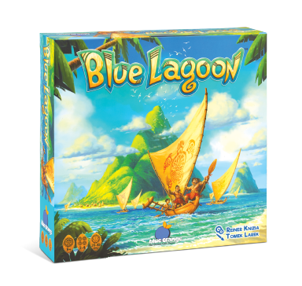
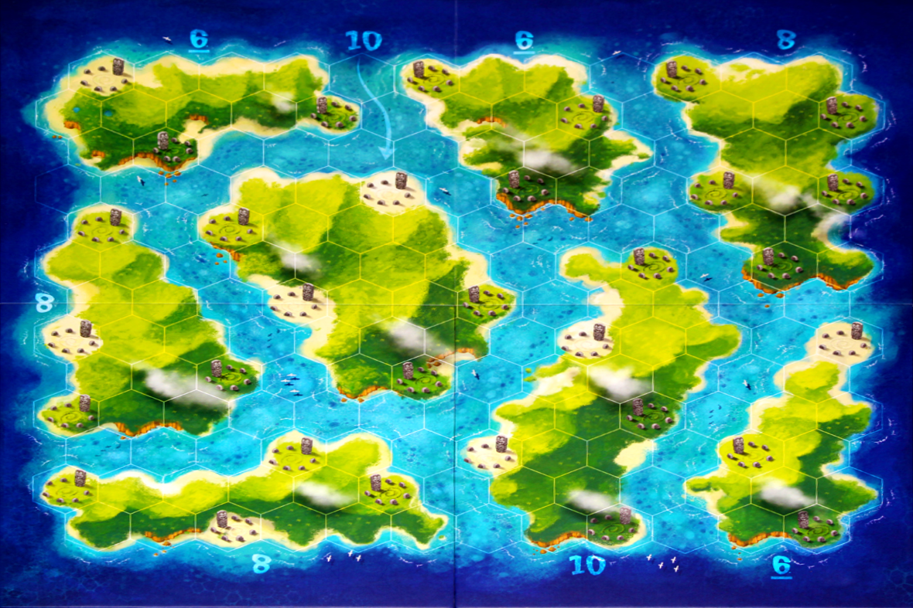

# COMP1110 Assignment 2

## Academic Honesty and Integrity

Honesty and integrity are of utmost importance. These goals are *not* at odds
with being resourceful and working collaboratively. You *should* be
resourceful, you should collaborate within your team, and you should discuss
the assignment and other aspects of the course with others taking the class.
However, *you must never misrepresent the work of others as your own*. If you
have taken ideas from elsewhere or used code sourced from elsewhere, you must
say so with *utmost clarity*. At each stage of the assignment you will be asked
to submit a statement of originality, either as a group or as individuals. This
statement is the place for you to declare which ideas or code contained in your
submission were sourced from elsewhere.

Please read the ANU's [official position](http://academichonesty.anu.edu.au/)
on academic honesty. If you have any questions, please ask me.

Carefully review the statements of originality in the [admin](admin) folder
which you must complete at each stage.  Edit the relevant statement and update
it as you complete each stage of the assignment, ensuring that when you
complete each stage, a truthful statement is committed and pushed to your repo.

## Purpose

In this assignment you will *work as a group* to master a number of major
themes of this course, including software design and implementation, group
work, using development tools such as Git and IntelliJ, and using JavaFX to
build a user interface.  **Above all, this assignment will emphasize group
work**; while you will receive an individual mark for your work based on your
contributions to the assignment, **you can only succeed if all members
contribute to your group's success**.

## Assignment Deliverables

The assignment is worth 30% of your total assessment, and it will be
marked out of 30.  So each mark in the assignment corresponds to a
mark in your final assessment for the course.  Note that for some
stages of the assignment, you will get a _group_ mark, and for others
you will be _individually_ marked.  The mark breakdown and the due
dates are described on the
[deliverables](https://cs.anu.edu.au/courses/comp1110/assessments/deliverables/)
page.

Your tutor will mark your work via GitLab, so it is essential that you
carefully follow instructions for setting up and maintaining your group
repository. You will be marked according to whatever is committed to your
repository at the time of the deadline. You will be assessed on how effectively
you use Git as a development tool.

## Problem Description

Your task is to implement in Java, using JavaFX, a board game called the
[Blue Lagoon](https://boardgamegeek.com/boardgame/244331/blue-lagoon).
The design of the game and all imagery shown in this README comes from
the game publishers, Blue Orange Games. You should either be creating
your own artwork or making use of other works with an appropriate license.

A copy of the [rulebook](assets/rules/rulebook.pdf) has been provided from the
[official site](https://blueorangegames.eu/en/games/blue-lagoon/).

You can also find several video tutorials explaining how to play the game
online, for example [this video](https://www.youtube.com/watch?v=0q1hWfH9S_8).

## Game Overview

In Blue Lagoon, you play as a seafaring tribe on a quest to settle and explore 
a newly discovered archipelago. Enlisting the help of all the settlers in your 
tribe to claim territory, and scavenging the resources you find, you will make 
history as one of the first tribes on the archipelago. But be careful! Other 
tribes have found the islands too, and it's a race to the top to see who can 
end up the most renowned tribe of the archipelago.

Blue Lagoon is a board game for 2-4 players. Each player manages a group
of settlers who will be finding precious resources and claiming islands in
the newly discovered archipelago.

The game is played over two phases - the exploration phase followed by the
settlement phase. On a player's turn, they will be playing one of the tokens
from their hand on to the board in order to work towards claiming resources 
and islands. At the end of each phase points are scored based on the islands 
each player claims and the resources they collect. Highest score wins!

An overview of the game rules is given below. Use this, in addition to the
resources linked above. If anything is unclear, please consult 
the [class forum](https://edstem.org/au/courses/10706/discussion/) for clarification.

## Game Rules

It is strongly encouraged to read the [rulebook](assets/rules/rulebook.pdf).
Though a brief overview of the rules will be provided here.

### Overview

#### Game
The game is played over two different phases - the exploration phase, and
then the settlement phase. The score is counted at the end of each phase, the 
highest score wins!

#### Components

All players start with 5 villages. In a 2 player game each player has 30 settlers,
in a 3 player game 25 settlers and a 4 player game 20 settlers.

There are 24 resources (coconuts, bamboo, water and precious stones)
and 8 additional statuettes (important: these are counted separately
to resources). All resources and statuettes will be randomly distributed
amongst the stone circles on the board at the start of the game.

The standard game is played on the below game board. On the game board you can
see eight different islands (each with a score attached) and 32 stone circles
which will hold the resources and statuettes. You will also see that the board
can be divided up into land tiles and water tiles.

### Exploration Phase

Each player sequentially takes turns playing a piece from their collection of
settler and village tokens.

The rules for playing a piece are as follows:
- A settler can be placed on any unoccupied water space
- A settler or a village can be placed on any unoccupied land space adjacent to one of their pieces.

If a piece is placed on a stone circle, the player instantly claims the resource in that space
into their hand.

### End of Exploration Phase

Once either of the end of phase conditions occur,
points are scored and the settlement phase begins.

#### End of Phase Conditions
The exploration phase ends when either:
- All resources (not including statuettes) have been collected
- No player has any remaining moves available

#### Scoring Exploration Phase

The rules for scoring are as below. Please refer to page 3 of
the rulebook for scoring examples.

**Total Islands**

Players with pieces on eight or more islands score 20 points.
Players with pieces on exactly seven islands score 10 points.
Otherwise, 0 points are scored.

**Links**

A (potentially) branching path of neighbouring settlers and villages 
belonging to a player forms a chain. Players earn points from the chain 
of their pieces which links the most islands. Players earn 5 points 
per linked island in this chain.

**Majorities**

The player with the most pieces on an island scores
the points indicated on the board for that island. 
In the case of a tie, the points are divided evenly
between the tied players, rounding down.

**Resources**

Players score points for the resources they claimed during the phase.

For each resource type (coconuts, bamboo, water and precious stones),
each player receives the following points:
- 4+ of a kind: 20 points
- 3 of a kind: 10 points
- 2 of a kind: 5 points

Additionally, if a player has collected all 4 different resources, they get 10 bonus points.

**Statuettes**

Players receive 4 points per claimed statuette.

### Settlement Phase

#### Setup
All settlers, resources and statuettes are removed from the board, as well 
as villages placed on stone circles. All villages except for those remaining 
on the board are discarded.

All resources and statuettes are then randomly distributed amongst the 
stone circles again.

The player after the player who ended the exploration phase
has the first turn.

#### Play

Play continues, this time however players may only place settlers
next to pieces they already own. That is, one cannot play on an 
unoccupied water space anymore unless it is adjacent to one of 
their pieces.

### End of Game

The settlement phase ends using the exact same conditions as the
exploration phase. 

Once the settlement phase ends, the score is again calculated 
using the same scoring system.

Each player adds the scores between the 2 phases.

The most points wins! If there is a tie, the player
with the most resources and statuettes wins. Otherwise,
the tied players share the victory!

## Encoding for Testing

This section describes a string encoding for the game state and player moves.
It will be necessary to work with this encoding when writing the methods in
`BlueLagoon.java`. This encoding has been designed purely for the purpose of
providing a common representation that both our tests and your game can understand.

**Importantly** we strongly discourage using this string encoding for anything
other than interfacing with our tests. The backend of your game (that encodes
the game logic) should have its own internal representation of the game
state and moves using appropriate classes, enums, and so on. To implement the
static methods in `BlueLagoon.java`, you should should be converting from
this string encoding to your internal game representation, performing the
relevant method calls to perform the desired operation, and then converting
back to the string encoding to provide a result for the tests.

The **Game State** string is made up of multiple parts segmented into statements. 
Each statement starts with a lowercase character to identify which statement it is, 
followed by space-separated information that is outlined below. Multiple statements are 
separated by a `;` character. *hint: investigate java string methods. split() will be
very useful...*

### Grammar Hints

The string statements are formally presented using "formal grammar"
notation (e.g., see [EBNF](https://en.wikipedia.org/wiki/Extended_Backus%E2%80%93Naur_form)).
If you are not familiar with formal grammars, this section gives a brief overview.
You don't need to fully understand these grammars so long as you can make sense of the
examples provided.

The symbols we will use include:

* Double quotes `""` are used to indicate a string literal.
  * E.g., `"A B"` is a string literal.
* The comma `,` is used to combine / concatenate strings.
  * E.g., `"A", "B", "C"` is equivalent to `"ABC"`.
* The pipe symbol `|` provides alternatives.
  * E.g., `"A" | "B" | "C"` means `"A"` or `"B"` or `"C"`.
* Braces `{` and `}` are used to indicate the enclosed can appear zero or
  more times.
  * E.g., `{"A"}` can be `""` or `"A"` or `"AA"` or ...
* Parentheses `(` and `)` allow items to be grouped.
  * E.g., `("A", " ") | "B"` can be `"A "` or `"B"`.

### Coordinates

To start with we define the form that coordinates take on which will be used in
other game statements. A coordinate is formally represented by the following
grammar:

`coordinate = row, ",", col`

where `row` and `col` are both non-negative integers representing a given board
row and column pair.

Coordinates are 0-indexed from the top left. The top-left tile is at coordinate
`"0,0"` (row 0, col 0). One tile to the right of this is `"0,1"`. The left-most
tile of the second row is `"1,0"`. The bottom-right tile is at `"12,11"`
noting that the number of columns in each row varies.

### Game Arrangement Statement

Contains the static board information of this game - you will need this to set up 
the board and players. This information will not change throughout the game. 

`gameArrangementStatement = "a ", boardHeight, " ", numPlayers, ";"`

where `boardHeight` and `numPlayers` are both positive integers.

> e.g. "a 13 2;"
>
> ^ The standard map layout - 13 high, 2 players

### Current State Statement

Contains the dynamic info of this game - this will change over the course of the game.

`currentStateStatement = "c ", playerId, " ", phase, ";"`

`phase = "E" | "S"`

and where `playerId` is a non-negative integer that represents the ID of
the current player whose turn it is.

>e.g. "c 0 E;"
>
>^ The current player to move is player 0 in the Exploration phase

### Island Statement

The layout of one island on the board - the board will be made up of a
number of these. Ths bonus score for an island is provided (see the game
rules for scoring - majorities). This is followed by a number of coordinates
that make up the island. Tiles that make up an island will be land tiles.
Some of the land tiles are also stone circles (see next section).
Different islands will not overlap tiles.
The coordinates are ordered in numerically ascending order with row before
column.

`islandStatement = "i ", bonus, {" ", coordinate}, ";"`

where `bonus` is a non-negative integer.

>e.g. "i 6 0,0 0,1 0,2 0,3 1,0 1,1 1,2 1,3 1,4 2,0 2,1;"
>
>^ The first island (top left) of the standard map

>e.g. "i 6 0,5 0,6 0,7 1,6 1,7 1,8 2,6 2,7 2,8 3,7 3,8;"
>
>^ The second island (top middle) of the standard map

>e.g. "i 6 7,12 8,11 9,11 9,12 10,10 10,11 11,10 11,11 11,12 12,10 12,11; i 8 0,9 0,10 0,11 1,10 1,11 1,12 2,10 2,11 3,10 3,11 3,12 4,10 4,11 5,11 5,12; i 8 4,0 5,0 5,1 6,0 6,1 7,0 7,1 7,2 8,0 8,1 8,2 9,0 9,1 9,2;"
>
>^ A sequence of three island statements appearing in the standard game string

### Stones Statement

The coordinates of all stone circles on the board. Stone circles will only 
appear on tiles belonging to an island. The tile a stone circle is located 
at will still 'belong' to the island as outlined in the island statement
for the purpose of scoring. 
There will always be exactly 32 stone circles. 
Coordinates are sorted in numerically ascending order.
*hint: parse all island statements before the stones statement*

`stonesStatement = "s", {" ", coordinate}, ";"`

>e.g. "s 0,0 0,5 0,9 1,4 1,8 1,12 2,1 3,5 3,7 3,10 3,12 4,0 4,2 5,9 5,11 6,3 6,6 7,0 7,8 7,12 8,2 8,5 9,0 9,9 10,3 10,6 10,10 11,0 11,5 12,2 12,8 12,11;"
>
>^ The stone circles on the base map

### Unclaimed Resources and Statuettes Statement

All resources and statuettes remaining on the board (not in a player's 
inventory). The statement gives the resource or statuettes type indicated 
by a capital letter (Coconut, Bamboo, Water, Precious stone, Statuette) 
followed by the coordinates where that resource or statuette can be found. 
Coordinates are sorted in numerically ascending order. 
*hint: you will want some more advanced string methods here. How would you 
extract just the coordinates of Bamboo? You know they will be between a unique 
'B' and a unique 'W'...*

`unclaimedResourcesAndStatuettesStatement = "r C", {" ", coordinate}, " B", {" ", coordinate}, " W", {" ", coordinate}, " P", {" ", coordinate}, " S", {" ", coordinate}, ";"`

>e.g. "r C 1,1 B 1,2 W P 1,4 S;"
>
>^ Coconut at 1,1, Bamboo at 1,2, Precious Stone at 1,4. No Water or Statuettes

### Player Statement

All player information. We give their ID and score, their 
resource counts, and the locations of their settlers and villages.
The settler and village coordinates are sorted in numerically ascending order

`playerStatement = "p ", playerId, " ", score, " ", coconut, " ", bamboo, " ", water, " ", preciousStone, " ", statuette, " S", {" ", coordinate}, " T", {" ", coordinate}, ";"`

where `coconut`, `bamboo`, `water`, `preciousStone`, `statuette`
are non-negative integers representing the number of each resource or
statuettes the player has collected during this phase. `score` is the
total score of the player.

>e.g. "p 1 42 1 2 3 4 5 S 5,6 8,7 T 1,2;"
>
>^ player 1 with score: 42, coconuts: 1, bamboo: 2, water: 3, precious stone: 4, statuettes: 5, placed settlers at 5,6 and 8,7, placed villages at 1,2

### Game State

The combined game state is made up of the following in order:

- 1 Game Arrangement Statement
- 1 Current State Statement
- Many Island Statements (as many as there are Islands on the map) - sorted ascending numerically by the island bonus (ties broken by numerically ascending coordinates)
- 1 Stones Statement
- 1 Unclaimed Resources Statement
- Many Player Statements (as many as there are Players) - sorted ascending numerically by player number

Formally this is:

`gameState = gameArrangementStatement, " ", currentStateStatement, {" ", islandStatement}, " ", stonesStatement, " ", unclaimedResourcesAndStatuettesStatement, {" ", playerStatement}`

>e.g. "a 13 2; c 0 E; i 6 0,0 0,1 0,2 0,3 1,0 1,1 1,2 1,3 1,4 2,0 2,1; i 6 0,5 0,6 0,7 1,6 1,7 1,8 2,6 2,7 2,8 3,7 3,8; i 6 7,12 8,11 9,11 9,12 10,10 10,11 11,10 11,11 11,12 12,10 12,11; i 8 0,9 0,10 0,11 1,10 1,11 1,12 2,10 2,11 3,10 3,11 3,12 4,10 4,11 5,11 5,12; i 8 4,0 5,0 5,1 6,0 6,1 7,0 7,1 7,2 8,0 8,1 8,2 9,0 9,1 9,2; i 8 10,3 10,4 11,0 11,1 11,2 11,3 11,4 11,5 12,0 12,1 12,2 12,3 12,4 12,5; i 10 3,3 3,4 3,5 4,2 4,3 4,4 4,5 5,3 5,4 5,5 5,6 6,3 6,4 6,5 6,6 7,4 7,5 7,6 8,4 8,5; i 10 5,8 5,9 6,8 6,9 7,8 7,9 7,10 8,7 8,8 8,9 9,7 9,8 9,9 10,6 10,7 10,8 11,7 11,8 12,7 12,8; s 0,0 0,5 0,9 1,4 1,8 1,12 2,1 3,5 3,7 3,10 3,12 4,0 4,2 5,9 5,11 6,3 6,6 7,0 7,8 7,12 8,2 8,5 9,0 9,9 10,3 10,6 10,10 11,0 11,5 12,2 12,8 12,11; r C B W P S; p 0 0 0 0 0 0 0 S T; p 1 0 0 0 0 0 0 S T;"
>
>^ The initial board. Two players, player 0 to start.

### Move String

We need an encoding for moves to play the game. Once the game is 
working you will be able to take a state string and create an instance 
of the game using your classes, then apply each move to your running game, 
and converting the resulting state back into a string that we can check against. 

`move = pieceType, " ", coordinate`

`pieceType = "S" | "T"`

>e.g. "S 2,3"
>
>^ Move: a settler is being played at coordinate 2,3

## Your High Level Task

Create a fully working game, using JavaFX to implement a playable
graphical version of the game in a 1200x700 window.

Notice that aside from the window size, the details of exactly how the
game looks etc., are **intentionally** left up to you. You may choose to
closely follow the look of the original board game, or you may choose to
present the game in a totally different manner.

The only **firm** requirements on the GUI are that:

* Your game must run using Java 17 and JavaFX 17.
* Your implementation must respect the specification of the game rules
  given here.
* Your game must be easy to play.
* Your game must run in a 1200x700 window.
* Your game must be executable on a standard lab machine from a jar file
  automatically built from your project called `game.jar` (as outlined in
  [D2E]).

In addition to the main GUI, the backend of your game (the part that
implements the game logic) should be linked to the static methods
declared in `BlueLagoon.java` so that we can test your implementation.

## Evaluation Criteria

[deliverables]: https://comp.anu.edu.au/courses/comp1110/assessments/deliverables/

It is essential that you refer to the **[deliverables]** page to check
that you understand each of the **deadlines**, what is required, and the
**mark breakdown**. This assignment has multiple deliverables, D2A to D2G.
A significant part of your assignment will be marked via tests run through
gitlab's continuous integration (CI) framework, so all submittable materials
will need to be committed and pushed to gitlab and in the *correct* locations,
as prescribed by the [deliverables] page.

*Some* marks in deliverables are attributed to the completion (and tests
passing if relevant) of specific **tasks**. There are 17 tasks (from #1 through
to #17) that are outlined in gitlab **issues** associated with your team's fork
of the assignment 2 project. Not all tasks have tests associated with them,
instead some will be manually marked.

**Importantly** not all activities you will have to perform to complete a
deliverable are covered by a task, instead refer to the [deliverables].

The deliverables that depend on tasks are summarised as:

* [D2A]: task #1
* [D2B]: task #2
* [D2C]: tasks #3 to #8
* [D2F]: tasks #9 to #17 (and tasks #3, #4, #6, #7, #8 to a small degree)

[D2A]: https://comp.anu.edu.au/courses/comp1110/assessments/deliverables/#D2A
[D2B]: https://comp.anu.edu.au/courses/comp1110/assessments/deliverables/#D2B
[D2C]: https://comp.anu.edu.au/courses/comp1110/assessments/deliverables/#D2C
[D2E]: https://comp.anu.edu.au/courses/comp1110/assessments/deliverables/#D2E
[D2F]: https://comp.anu.edu.au/courses/comp1110/assessments/deliverables/#D2F

The tasks (mostly) increase in difficulty the higher the task number. However,
note that the GUI-related tasks will generally require significantly more work
than other tasks related to backend game logic.

Some, but not all, tasks will depend on the completion of earlier tasks. For
example, a later task might build on or make use of game logic developed as
part of an earlier task. We don't make these dependencies explicit because
the relationships should become relatively apparent after a bit of design
work (and they will depend somewhat on your design).

Keep the relative difficulty and the potential dependencies between tasks
in mind when negotiating which team member will work on what tasks. Try to
structure things so that you can work relatively independently, or otherwise
agree on some clear internal deadlines when one member relies on the output
of another.
